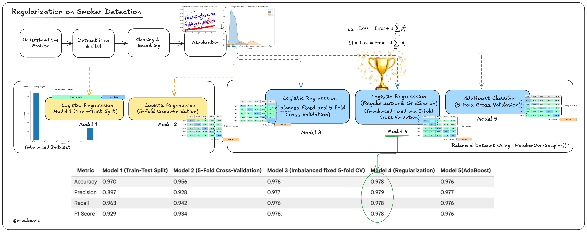

# Smoker Status Prediction Challenge - Module 3

## Project Overview

This project builds and compares multiple classification models to predict whether an individual is a smoker or not based on health and demographic features. The challenge involves handling class imbalance, applying regularization techniques, and experimenting with ensemble methods to optimize model performance.

### Objectives
  
<p align="center">
  
</p>
  
**Part 1**

* **First Model:** Build a simple classification model using **scikit-learn’s**  library.
* **Second Model:** Build a classification model using k-folds method.
* Analyze  how  the  model  performs  and  what patterns it may be capturing in both.

**Part 2**

Further imporvements for the classification model using:
* **Third Model:** fixing the imbalanced `smoker` distribution through `RandomOverSampler`.
* **Fourth Model:** Regularization applied using Grid Search and also fixing the imbalanced `smoker` distribution through `RandomOverSampler`.
* **Fifth Model:** applying `AdaBoost` to enhance the performance.

## Dataset

**Source:** Insurance Dataset (GitHub)

### Features

| Feature | Type | Description |
|---------|------|-------------|
| `age` | Numerical | Age of primary beneficiary (18-64 years) |
| `sex` | Categorical | Insurance contractor gender (male/female) |
| `bmi` | Numerical | Body Mass Index (kg/m²), ideally 18.5-24.9 |
| `children` | Categorical | Number of dependents covered (0-5) |
| `smoker` | **Target** | Smoker status (yes/no) |
| `region` | Categorical | US residential area (northeast, southeast, southwest, northwest) |
| `charges` | Numerical | Individual medical costs billed by insurance |

### Dataset Statistics
- **Total Records:** 1,338
- **Features:** 6 (excluding target)
- **Target Variable:** `smoker` (Binary: Yes=1, No=0)
- **Class Distribution:** 
  - Non-smokers: 79.5% (1,064 samples)
  - Smokers: 20.5% (274 samples)
  - **Imbalanced dataset detected**


## Data Preprocessing

### Handling Missing Values
- **Issue:** 3 missing values in BMI column
- **Solution:** Imputed with mode value (32.3)

### Encoding Categorical Variables
- `sex`: {male: 0, female: 1}
- `smoker`: {no: 0, yes: 1}
- `region`: {southwest: 0, southeast: 1, northwest: 2, northeast: 3}
- `children`: Already discrete, treated as categorical

### Feature Scaling
- Applied StandardScaler to normalize all features
- Prevents high-magnitude features (like `charges`) from dominating the model


## Exploratory Data Analysis (EDA)

### Key Findings

1. **Feature Correlations:**
   - Smoker ↔ Charges: +0.79 (Strong positive correlation)
   - Age ↔ BMI: +0.30 (Weak positive correlation)

2. **Distribution Insights:**
   - Age: Nearly uniform distribution
   - BMI: Approximately normal distribution
   - Charges: Positively skewed distribution
   - Smoker: Highly imbalanced (20.5% positive class)

3. **Class Imbalance Issue:**
   - Non-smokers overwhelmingly represent 79.5% of data
   - Model may be biased toward predicting non-smoker status
   - **Mitigations:** Class weights, RandomOverSampler, F1/ROC-AUC metrics


## Model Development

### Model 1: Simple Train-Test Split (Baseline)

**Approach:** Standard 80/20 train-test split with LogisticRegression

**Results:**
| Metric | Score |
|--------|-------|
| Accuracy | 0.970 |
| Precision | 0.897 |
| Recall | 0.963 |
| F1-Score | 0.929 |

**Insight:** Strong performance, but single split may not reflect true generalization.


### Model 2: 5-Fold Cross-Validation

**Approach:** Pipeline combining StandardScaler + LogisticRegression with 5-fold CV

**Results:**
| Metric | Score |
|--------|-------|
| Accuracy | 0.956 |
| Precision (Macro) | 0.928 |
| Recall (Macro) | 0.942 |
| F1-Score (Macro) | 0.934 |

**Insight:** More robust estimate; slightly lower accuracy reveals true model generalization vs. single test split optimism.

### Model 3: RandomOverSampler for Class Imbalance

**Approach:** Address class imbalance by oversampling minority class to 1:1 ratio, then apply 5-fold CV

**Data Augmentation:**
- Original: 1,338 samples → Balanced: 2,128 samples
- New distribution: 1,064 non-smokers + 1,064 smokers

**Results:**
| Metric | Score |
|--------|-------|
| Accuracy | 0.977 |
| Precision (Macro) | 0.978 |
| Recall (Macro) | 0.976 |
| F1-Score (Macro) | 0.976 |

**Insight:** Significant improvement across all metrics. Balanced dataset enables model to learn smoker patterns effectively.


### Model 4: GridSearchCV Regularization ⭐ **RECOMMENDED**

**Approach:** Hyperparameter tuning on balanced dataset using GridSearchCV

**Hyperparameter Grid:**
```python
param_grid = {
    'model4__C': [0.01, 0.1, 1, 10, 100],        # Regularization strength (smaller = stronger)
    'model4__penalty': ['l1', 'l2'],              # Regularization type
    'model4__solver': ['liblinear']               # Optimization algorithm
}
```

**Optimal Parameters Found:**
- `C`: 10 (Moderate regularization strength)
- `penalty`: L1 (Sparse features, feature selection)
- `solver`: liblinear

**Results:**
| Metric | Score |
|--------|-------|
| Accuracy | 0.978 |
| Precision (Macro) | 0.979 |
| Recall (Macro) | 0.978 |
| F1-Score (Macro) | 0.978 |

**Advantages:**
- Highest performance across all metrics
- Regularization prevents overfitting on high-value charges feature
- Computationally efficient
- Best trade-off between performance and complexity


### Model 5: AdaBoost Ensemble

**Approach:** Boosting algorithm with 1,000 weak learners (decision stumps)

**Configuration:**
```python
AdaBoostClassifier(n_estimators=1000, learning_rate=0.1, random_state=42)
```

**Results:**
| Metric | Score |
|--------|-------|
| Accuracy | 0.976 |
| Precision (Macro) | 0.977 |
| Recall (Macro) | 0.976 |
| F1-Score (Macro) | 0.976 |

**Insight:** Comparable to Model 4 but with higher computational cost. Marginal improvement doesn't justify added complexity.


## Model Comparison Summary

| Metric | Model 1 | Model 2 | Model 3 | **Model 4** | Model 5 |
|--------|---------|---------|---------|-----------|---------|
| **Accuracy** | 0.970 | 0.956 | 0.976 | **0.978** | 0.976 |
| **Precision** | 0.897 | 0.928 | 0.977 | **0.979** | 0.977 |
| **Recall** | 0.963 | 0.942 | 0.976 | **0.978** | 0.976 |
| **F1-Score** | 0.929 | 0.934 | 0.976 | **0.978** | 0.976 |
| **Complexity** | Low | Medium | Medium | **Medium** | High |
| **Computation Time** | Fast | Medium | Medium | **Medium** | Slow |


## Final Recommendation: Model 4

**Why Model 4 (GridSearchCV Regularization)?**

1. **Best Performance:** Highest scores across all metrics (97.8-97.9%)
2. **Optimal Complexity:** Balanced between performance gains and computational efficiency
3. **Production-Ready:** Simpler than ensemble methods, easier to deploy and maintain
4. **Interpretability:** L1 regularization provides feature selection insights
5. **Generalization:** Regularization prevents overfitting on outlier charges values

**Use Case:** Recommended for production deployment in insurance smoker status classification systems.

## Key Insights & Takeaways

### Class Imbalance Resolution
Oversampling minority class improved model performance by ~4.2% in F1-score (0.934 → 0.976).

### Regularization Benefits
L1 regularization with optimal C=10 balanced model complexity and predictive power, yielding 0.2% improvement over oversampling alone.

### Ensemble Methods Trade-off
While AdaBoost performed well, marginal improvements (~0.2%) didn't justify 3-5x increase in training time.

### Cross-Validation Advantage
5-fold CV provided more reliable generalization estimates compared to single train-test split, revealing true model performance gaps.


## Project Structure

```
regularization_smoker_status/
├── README.md                 # This file
├── insurance.csv             # Dataset
└── smoker_prediction.ipynb   # Jupyter notebook with full analysis
```


## Usage

### Running the Analysis
```python
# Clone the repository
git clone https://github.com/allaalmouiz/regularization_smoker_status.git
cd regularization_smoker_status

# Run the Jupyter notebook
jupyter notebook smoker_prediction.ipynb
```

### Making Predictions with Model 4
```python
from sklearn.pipeline import Pipeline
from sklearn.preprocessing import StandardScaler
from sklearn.linear_model import LogisticRegression

# Load your trained model (from Model 4)
best_model = Pipeline([
    ('scaler', StandardScaler()),
    ('clf', LogisticRegression(C=10, penalty='l1', solver='liblinear'))
])

# Make predictions
predictions = best_model.predict(new_data)
probabilities = best_model.predict_proba(new_data)
```


---

**Last Updated:** 2026  
**License:** Educational Project (ZAKA ©)
